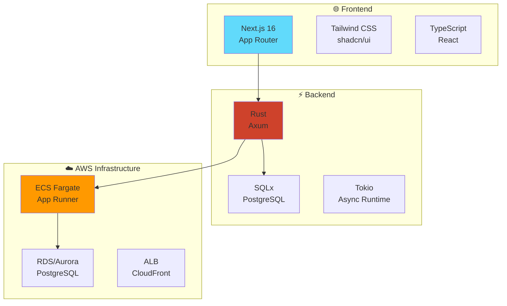
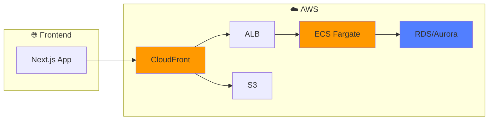

<div align="center">

# 🦀 Rust × Next.js × AWS × Terraform Tech Blog


**Rust をバックエンド、Next.js 16（TypeScript）をフロントエンドに使い、AWS × Terraform でインフラも含めて作る個人テックブログ用モノレポです。**

_Rust 公式ドキュメントを超初心者向けに噛み砕く記事や普段の開発で得た知見や学習内容を書きながら、アプリケーションとインフラの両方を学ぶことを目的としています。_

---

<table>
<tr>
<td>

**目標**

- フルスタック開発の習得
- インフラ自動化の実践
- 技術記事の執筆

</td>
<td>

**進捗**

- [ ] フロントエンド構築
- [ ] バックエンド API 開発
- [ ] AWS インフラ構築

</td>
<td>

**技術選定理由**

- **Rust**: パフォーマンス & 安全性
- **Next.js**: モダンな React 開発
- **AWS**: スケーラブルなクラウド

</td>
</tr>
</table>

</div>

---

## ドキュメント目次

<div align="center">

### 詳細ドキュメントは各ディレクトリのREADMEをご覧ください

</div>

<table>
<tr>
<th>ディレクトリ</th>
<th>内容</th>
<th>ドキュメント</th>
</tr>
<tr>
<td>

**Frontend**
<br>
Next.js 16 + TypeScript

</td>
<td>

- App Router 設計
- Tailwind CSS 構成
- API 連携方法
- 開発環境構築

</td>
<td>

**[Frontend README](./apps/frontend/README.md)**

</td>
</tr>
<tr>
<td>

**Backend**
<br>
Rust + Axum + SQLx

</td>
<td>

- レイヤードアーキテクチャ
- データベース設計
- セキュリティ設計
- API 仕様

</td>
<td>

**[Backend README](./apps/backend/README.md)**

</td>
</tr>
<tr>
<td>

**Infrastructure**
<br>
AWS + Terraform

</td>
<td>

- Terraform 構成
- AWS リソース設計
- 環境分離戦略
- デプロイ手順

</td>
<td>

**[Infrastructure README](./infra/README.md)**

</td>
</tr>
<tr>
<td>

**Packages**
<br>
共通ライブラリ

</td>
<td>

- UI コンポーネント
- ユーティリティ関数
- 型定義・スキーマ
- 使用方法

</td>
<td>

*各パッケージのREADME（予定）*

</td>
</tr>
</table>

---

## 技術スタック

<table>
<tr>
<th>Frontend</th>
<th>Backend</th>
<th>Infrastructure</th>
</tr>
<tr>
<td>


- App Router 構成
- コンポーネント駆動開発
- 自動テスト & Lint

</td>
<td>


- 非同期処理
- 型安全な DB アクセス
- レイヤードアーキテクチャ

</td>
<td>


- Infrastructure as Code
- コンテナオーケストレーション
- マネージドサービス活用

</td>
</tr>
</table>

---

## アーキテクチャ概要

<div align="center">



</div>

## ディレクトリ構成

<details>
<summary>🔍 <strong>プロジェクト全体構造</strong></summary>

```
blog/
├── 📱 apps/
│   ├── 🌐 frontend/      # Next.js 16 + TS + Tailwind + shadcn + Jest + Husky
│   └── ⚡ backend/       # Rust + Tokio + Axum + SQLx
├── 📦 packages/
│   ├── 🎨 ui/            # 共通 UI コンポーネント（TS/React）
│   ├── 🛠️ utils/         # フロント用ユーティリティ（TS）
│   └── 📋 schema/        # API レスポンスなどの型・スキーマ（TS）
├── 🏗️ infra/
│   └── terraform/
│       ├── 🧪 staging/   # ステージング環境用の AWS リソース定義
│       └── 🚀 prod/      # 本番環境用の AWS リソース定義
├── 🐳 docker-compose.yml # ローカル開発用（frontend + backend + local Postgres）
├── 📝 .env.example       # ルート共通の環境変数テンプレ
├── 🚫 .gitignore
└── 📖 README.md
```

</details>

---

## Frontend Architecture

<div align="center">

### Next.js 16 + TypeScript + Tailwind CSS

</div>

<details>
<summary>📁 <strong>Frontend ディレクトリ構造</strong></summary>

```
apps/frontend/
├── 📱 app/
│   └── (blog)/
│       ├── 🎨 layout.tsx
│       ├── 📄 page.tsx          # 記事一覧
│       └── [slug]/
│           └── 📖 page.tsx      # 記事詳細
├── 🧩 components/
│   ├── 🏗️ layout/
│   └── 📝 blog/
├── 📚 lib/
│   ├── 🔌 api-client/           # Rust backend API 用の HTTP クライアント
│   └── 🔐 auth/                 # 認証・セッションロジック（必要に応じて）
├── 🧪 tests/
│   ├── unit/
│   └── e2e/
├── 🖼️ public/
├── 🎨 styles/
│   └── globals.css           # Tailwind エントリ
├── ⚙️ tailwind.config.ts
├── 📦 postcss.config.mjs
├── 🧪 jest.config.ts
├── ⚙️ next.config.mjs
├── 📋 package.json
└── 📄 tsconfig.json
```

</details>

<table>
<tr>
<td width="33%">

**🎯 App Router 構成**

- `app/(blog)/` でブログ機能を整理
- URL とコードの両方を最適化
- ファイルベースルーティング

</td>
<td width="33%">

**🎨 UI/UX**

- Tailwind CSS でユーティリティファースト
- shadcn/ui で一貫性のあるデザイン
- レスポンシブ対応

</td>
<td width="33%">

**🧪 品質保証**

- Jest + React Testing Library
- Husky で pre-commit チェック
- TypeScript による型安全性

</td>
</tr>
</table>

---

## Backend Architecture

<div align="center">

### Rust + Axum + SQLx + PostgreSQL

</div>

<details>
<summary>🦀 <strong>Backend ディレクトリ構造</strong></summary>

```
apps/backend/
├── 📦 src/
│   ├── 🚀 main.rs
│   ├── 🌐 api/               # ルーティング & ハンドラ（REST / JSON）
│   │   ├── mod.rs
│   │   ├── 📝 posts.rs       # /posts, /posts/{id}
│   │   └── 💚 health.rs      # /health
│   ├── 🏛️ domain/            # ドメインロジック（HTTP/DB 非依存）
│   │   ├── mod.rs
│   │   └── 📄 post.rs        # Post エンティティ
│   ├── 🏗️ infrastructure/    # DB・外部サービス
│   │   ├── mod.rs
│   │   └── 🗄️ db.rs          # SQLx + PostgreSQL
│   └── 🔒 security/          # セキュリティ関連（ヘッダ・認証など）
│       ├── mod.rs
│       ├── 🛡️ headers.rs
│       └── 🔐 auth.rs
└── 📋 Cargo.toml
```

</details>

<table>
<tr>
<td width="25%">

**🌐 API Layer**

- Axum でルーティング
- JSON レスポンス
- エラーハンドリング
- OpenAPI 対応

</td>
<td width="25%">

**🏛️ Domain Layer**

- ビジネスロジック
- エンティティ定義
- HTTP/DB 非依存
- テスタブル設計

</td>
<td width="25%">

**Infrastructure**

- SQLx で型安全な DB アクセス
- PostgreSQL 連携
- マイグレーション管理
- コネクションプール

</td>
<td width="25%">

**🔒 Security**

- セキュリティヘッダ
- 認証・認可
- CORS 設定
- レート制限

</td>
</tr>
</table>

> 🚀 **デプロイ先**: AWS ECS Fargate / App Runner でコンテナとして動作

---

## packages

```
packages/
├── ui/
│   ├── src/components/
│   │   ├── Button.tsx
│   │   ├── Badge.tsx
│   │   ├── CodeBlock.tsx
│   │   └── Layout.tsx
│   ├── package.json
│   └── tsconfig.json
├── utils/
│   ├── src/
│   │   ├── date.ts        # 日付整形など
│   │   ├── slug.ts
│   │   └── markdown.ts
│   ├── package.json
│   └── tsconfig.json
└── schema/
    ├── src/
    │   ├── post.ts        # Post の型 / Zod スキーマ
    │   └── index.ts
    ├── package.json
    └── tsconfig.json
```

フロントエンド間で共通利用する UI / ユーティリティ / スキーマをここにまとめる。

---

## infra/terraform

```
infra/terraform/
├── staging/
│   ├── main.tf
│   ├── variables.tf
│   └── outputs.tf
└── prod/
    ├── main.tf
    ├── variables.tf
    └── outputs.tf
```

Terraform を使って、VPC / ECS / ALB / RDS などの AWS リソースをコードとして管理。

ステージングと本番でディレクトリを分けておき、ワークスペースや変数で環境差分を吸収する構成にする。

---

## ローカル開発フロー

<div align="center">

### 開発環境セットアップ

</div>

### 🚀 Docker での統合起動（推奨）

**前提条件**: Docker Desktop をインストールして起動してください

<table>
<tr>
<th>🚀 初回起動・ビルド</th>
<th>🔄 通常起動</th>
<th>🛑 停止</th>
</tr>
<tr>
<td>

```bash
# 開発環境（ホットリロード対応）
docker-compose -f docker-compose.dev.yml up --build

# または本番環境構成
docker-compose up --build
```

</td>
<td>

```bash
# 開発環境
docker-compose -f docker-compose.dev.yml up

# 本番環境構成
docker-compose up

# バックグラウンド起動
docker-compose up -d
```

</td>
<td>

```bash
# フォアグラウンドの場合: Ctrl+C

# バックグラウンドの場合
docker-compose down

# ボリュームも削除
docker-compose down -v
```

</td>
</tr>
</table>

### 📂 Docker構成の違い

<table>
<tr>
<th>🧪 開発環境 (`docker-compose.dev.yml`)</th>
<th>🚀 本番環境 (`docker-compose.yml`)</th>
</tr>
<tr>
<td>

**特徴**
- ホットリロード対応
- ファイル変更が即座に反映
- デバッグログ出力

**使用場面**
- 日常の開発作業
- フロントエンド・バックエンドの修正

**起動コマンド**
```bash
docker-compose -f docker-compose.dev.yml up
```

</td>
<td>

**特徴**
- 本番環境に近い構成
- 最適化されたビルド
- 軽量なイメージ

**使用場面**
- 本番環境テスト
- パフォーマンス確認

**起動コマンド**
```bash
docker-compose up
```

</td>
</tr>
</table>

### 🔧 個別起動（従来方式）

<table>
<tr>
<th>1️⃣ 依存関係インストール</th>
<th>2️⃣ 環境変数設定</th>
<th>3️⃣ 開発サーバ起動</th>
</tr>
<tr>
<td>

```bash
# フロントエンド
cd apps/frontend
npm install

# バックエンド
cd apps/backend
cargo build
```

</td>
<td>

```bash
# 環境変数テンプレをコピー
cp .env.example .env

# 各アプリ固有の設定
cp apps/frontend/.env.example \
   apps/frontend/.env.local
cp apps/backend/.env.example \
   apps/backend/.env.local
```

</td>
<td>

```bash
# PostgreSQL のみ Docker で起動
docker-compose up postgres -d

# フロントエンド開発サーバ
cd apps/frontend && npm run dev

# バックエンド開発サーバ
cd apps/backend && cargo run
```

</td>
</tr>
</table>

### 🌐 アクセス URL

<div align="center">

**🖥️ Frontend**: http://localhost:3000  
**⚡ Backend API**: http://localhost:8000  
**📊 Backend Swagger UI**: http://localhost:8000/swagger-ui  
**🗄️ Database**: localhost:5432  
**🔧 pgAdmin**: http://localhost:5050 (admin@example.com / admin)

</div>

### ⚠️ トラブルシューティング

<details>
<summary>🐳 Docker関連の問題</summary>

**Docker Daemonが起動していない**
```bash
# Docker Desktop を起動してから再実行
docker-compose up
```

**ポートが既に使用されている**
```bash
# 使用中のポートを確認
lsof -i :3000
lsof -i :8000

# 既存のコンテナを停止
docker-compose down
```

**ビルドエラーが発生**
```bash
# キャッシュを無視して再ビルド
docker-compose build --no-cache
docker-compose up --build
```

</details>

<details>
<summary>🦀 Rustバックエンドの問題</summary>

**依存関係のエラー**
```bash
# 最新のRustに更新
rustup update

# 依存関係の再インストール
cargo clean
cargo build
```

**データベース接続エラー**
```bash
# PostgreSQLが起動しているか確認
docker-compose ps postgres

# 環境変数を確認
echo $DATABASE_URL
```

</details>

---

## AWS インフラストラクチャ

<div align="center">

### Infrastructure as Code with Terraform

</div>

<table>
<tr>
<th>Staging Environment</th>
<th>Production Environment</th>
</tr>
<tr>
<td>

```bash
cd infra/terraform/staging
terraform init
terraform plan
terraform apply
```

**リソース構成**

- ECS Fargate (開発用)
- RDS (小規模インスタンス)
- ALB + CloudFront
- S3 (静的アセット)

</td>
<td>

```bash
cd infra/terraform/prod
terraform init
terraform plan
terraform apply
```

**リソース構成**

- ECS Fargate (本番用)
- Aurora Serverless v2
- ALB + CloudFront + WAF
- S3 + CloudFront

</td>
</tr>
</table>

<div align="center">



</div>

> 📝 **学習ログ**: 各インフラ構成の構築過程は技術ブログ記事として記録し、学習内容を共有予定

---

<div align="center">

## プロジェクトの特徴

<table>
<tr>
<td align="center">

**Modern Rust**
<br>
最新の Rust エコシステムを活用した<br>
高性能・安全なバックエンド開発

</td>
<td align="center">

**Next.js 16**
<br>
App Router を使った<br>
モダンなフロントエンド開発

</td>
<td align="center">

**AWS Native**
<br>
クラウドネイティブな<br>
スケーラブルなインフラ構築

</td>
<td align="center">

**Learning by Building**
<br>
実装しながら学ぶ<br>
技術ブログとしての記録

</td>
</tr>
</table>

---

### この README について

**「Rust × Next.js × AWS × Terraform でテックブログを作るモノレポ」の全体像とアーキテクチャの意図をまとめたものです。**

実装と学習の進捗に合わせて随時アップデートしていきます。

[](https://github.com/kohtakochi)

</div>
