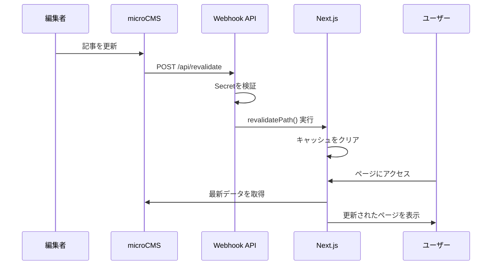

# 🔄 On-Demand Revalidation 設定ガイド

microCMSで記事を更新したら、**即座にサイトに反映**させる仕組みです。

## 📋 問題と解決策

### 問題
- localhost（開発環境）: 更新が即座に反映される ⚡
- デプロイ後（本番環境）: 1時間待たないと反映されない 🐌

### 原因
Next.jsの**ISR（Incremental Static Regeneration）**により、ページが1時間キャッシュされるため。

```typescript
export const revalidate = 3600; // 1時間キャッシュ
```

### 解決策
microCMSの**Webhook**を使って、記事更新時に自動でキャッシュをクリア。

---

## 🚀 セットアップ手順

### 1️⃣ シークレットキーの生成

強力なランダム文字列を生成:

```bash
# macOS/Linux
openssl rand -base64 32

# または
node -e "console.log(require('crypto').randomBytes(32).toString('base64'))"
```

生成された文字列を `.env.local` と本番環境の環境変数に設定:

```env
REVALIDATE_SECRET=your-generated-secret-here-minimum-32-characters
```

### 2️⃣ Vercel（またはホスティング先）に環境変数を追加

**Vercelの場合:**

1. Vercelダッシュボードを開く
2. プロジェクト → Settings → Environment Variables
3. 以下を追加:
   ```
   Key: REVALIDATE_SECRET
   Value: (ステップ1で生成した値)
   ```
4. Save → Redeploy

**他のホスティングサービスの場合:**
- 環境変数の設定方法に従って `REVALIDATE_SECRET` を追加

### 3️⃣ microCMS側のWebhook設定

1. microCMS管理画面にログイン
2. 対象のAPI設定 → **Webhook** タブ
3. 「Webhookを追加」をクリック

#### Webhook設定内容

| 項目 | 値 |
|------|-----|
| **URL** | `https://kohta-tech-blog.com/api/revalidate?secret=YOUR_SECRET` |
| **カスタムリクエストヘッダー** | 不要（クエリパラメータで認証） |
| **トリガー** | ✅ コンテンツの公開<br>✅ コンテンツの更新<br>✅ コンテンツの削除 |
| **対象API** | `blogs`, `book`, `topics` すべてに設定 |

**重要:** `YOUR_SECRET` を実際の `REVALIDATE_SECRET` の値に置き換えてください。

例:
```
https://kohta-tech-blog.com/api/revalidate?secret=a1b2c3d4e5f6...
```

### 4️⃣ 動作確認

1. microCMSで記事を更新
2. Webhookが自動で実行される（microCMS管理画面のWebhookログで確認可能）
3. サイトを再読み込み → **即座に反映！** ✨

---

## 🧪 手動テスト

開発中に手動でキャッシュをクリアする方法:

```bash
# トップページのキャッシュをクリア
curl "http://localhost:3000/api/revalidate?secret=YOUR_SECRET&path=/ja"

# ブログ詳細ページのキャッシュをクリア
curl "http://localhost:3000/api/revalidate?secret=YOUR_SECRET&path=/ja/blog/abc123"
```

**本番環境:**
```bash
curl "https://kohta-tech-blog.com/api/revalidate?secret=YOUR_SECRET&path=/ja"
```

---

## 🔒 セキュリティ

### なぜSecretが必要？

Secretトークンがないと、誰でもキャッシュをクリアできてしまい、**サーバーリソースを浪費**される可能性があります。

### ベストプラクティス

1. **強力なランダム文字列を使う**（最低32文字）
2. **絶対にGitにコミットしない**（`.gitignore`で除外済み）
3. **定期的に更新する**（セキュリティ上の懸念がある場合）

---

## 📊 仕組みの詳細



---

## 🐛 トラブルシューティング

### Webhookが動作しない

1. **microCMSのWebhookログを確認**
   - エラーコードをチェック（401: 認証失敗、500: サーバーエラー）

2. **Secretが正しいか確認**
   ```bash
   # 環境変数を確認（Vercel）
   vercel env ls
   ```

3. **エンドポイントにアクセスできるか確認**
   ```bash
   curl -X POST "https://kohta-tech-blog.com/api/revalidate?secret=YOUR_SECRET" \
     -H "Content-Type: application/json" \
     -d '{"api":"blogs","id":"test","type":"update"}'
   ```

### 更新が反映されない

1. **ブラウザキャッシュをクリア**（Cmd+Shift+R / Ctrl+Shift+R）
2. **CDNキャッシュの確認**（VercelのCDNキャッシュも影響する場合がある）
3. **Vercelのログを確認**（デプロイログやFunction Logs）

---

## 📝 参考リンク

- [Next.js On-Demand Revalidation](https://nextjs.org/docs/app/building-your-application/data-fetching/incremental-static-regeneration#on-demand-revalidation)
- [microCMS Webhook](https://document.microcms.io/manual/webhook-setting)
- [Vercel Environment Variables](https://vercel.com/docs/environment-variables)

---

**最終更新**: 2026年2月9日
